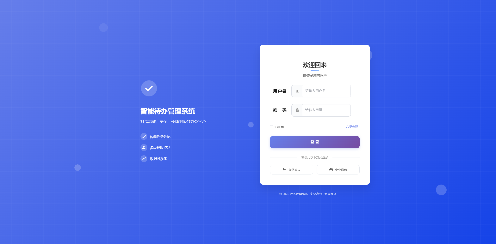
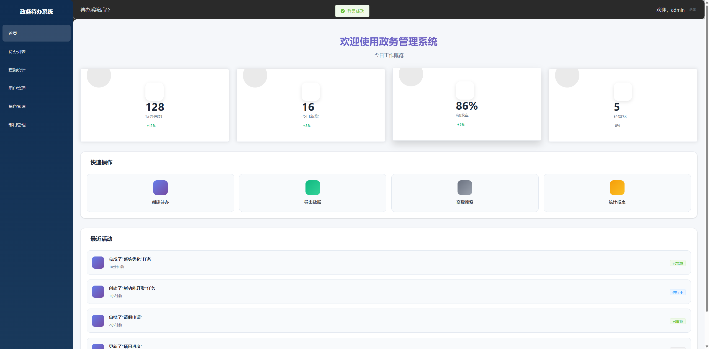

# Gov Todo Micro - 微服务政务待办事项管理系统

## 项目概述

Gov Todo Micro 是一个基于 Spring Cloud 的微服务架构待办事项管理系统，采用分布式设计理念，为政府办公提供高效、可扩展的待办管理解决方案。

## 界面展示

### 登录界面

<p align="center">
  
</p>

### 首页展示

<p align="center">
  
</p>


## 技术栈

### 核心框架
- **Java 21**: 项目主要开发语言
- **Spring Boot 2.7.15**: 应用框架
- **Spring Cloud 2021.0.5**: 微服务框架
- **Spring Cloud Alibaba 2021.0.5.0**: 阿里巴巴微服务解决方案

### 微服务组件
- **Spring Cloud Gateway**: API 网关
- **Nacos**: 服务注册与发现、配置中心
- **Sentinel**: 服务限流降级
- **Spring Cloud LoadBalancer**: 负载均衡

### 数据与缓存
- **MyBatis 2.3.2**: 持久层框架
- **MySQL 5.7+**: 关系型数据库
- **Redis**: 缓存中间件

### 安全与认证
- **Spring Security**: 安全框架
- **JWT (jjwt 0.11.5)**: 无状态认证

### 日志与监控
- **ELK Stack (7.17.0)**: Elasticsearch + Logstash + Kibana
- **Logback**: 日志框架
- **Logstash Logback Encoder**: JSON日志输出

### 构建与测试
- **Maven 3.6+**: 项目构建工具
- **JUnit 5**: 单元测试框架
- **Mockito**: Mock框架
- **JaCoCo 0.8.11**: 测试覆盖率工具

## 项目架构

```
gov-todo-micro/
├── gateway-server/          # API 网关服务 (端口: 8081)
│   ├── filter/             # 网关过滤器 (认证、限流)
│   ├── config/             # 网关配置 (Sentinel、路由)
│   └── resources/
│       ├── application.yml # 网关配置
│       └── logback-spring.xml # 日志配置
├── system-service/          # 系统管理服务 (端口: 8091)
│   ├── controller/         # REST API控制器
│   ├── service/            # 业务逻辑层
│   ├── mapper/             # 数据访问层
│   ├── config/             # 安全与缓存配置
│   └── resources/
│       ├── application.yml
│       └── logback-spring.xml
├── todo-service/            # 待办事项服务 (端口: 8090)
│   ├── controller/
│   ├── service/
│   ├── mapper/
│   └── resources/
│       ├── application.yml
│       └── logback-spring.xml
├── common/                  # 公共模块
│   ├── utils/              # 工具类 (JWT、Redis、认证)
│   ├── config/             # 通用配置 (Redis、缓存)
│   └── test/               # 测试工具类
├── docs/
│   ├── sql/                # 数据库初始化脚本
│   └── elk/                # ELK部署配置
│       ├── docker-compose.yml
│       ├── logstash.conf
│       └── README.md
└── pom.xml                 # 父 POM 文件
```

## 模块说明

### 1. gateway-server (网关服务)
- **API 网关入口**: 统一请求路由和过滤
- **服务发现**: 基于 Nacos 的动态服务发现
- **负载均衡**: Spring Cloud LoadBalancer 客户端负载均衡
- **统一认证**: JWT 令牌验证，白名单机制
- **限流降级**: Sentinel 网关流控，防止服务雪崩
- **路由配置**: 支持路径重写和谓词匹配

**核心组件:**
- `AuthGlobalFilter`: JWT 统一认证过滤器
- `SentinelGatewayConfig`: Sentinel 流控配置
- 认证白名单: `/api/login`, `/api/register` 等

### 2. system-service (系统管理服务)
- **用户管理**: 用户CRUD、登录注册、密码重置
- **角色权限管理**: 角色分配、权限控制
- **部门管理**: 组织架构管理
- **字典管理**: 系统字典配置
- **缓存支持**: Redis 缓存用户查询结果
- **限流保护**: Sentinel 资源保护
- **安全认证**: Spring Security + JWT

**核心特性:**
- `@Cacheable` 用户查询缓存
- `@SentinelResource` 登录接口限流
- 基于 Gateway 传递的用户信息进行权限校验

### 3. todo-service (待办事项服务)
- **待办事项增删改查**: 完整的 CRUD 操作
- **状态管理**: 待办状态流转控制
- **任务转派**: 待办事项转交功能
- **统计分析**: 待办完成情况统计
- **缓存优化**: Redis 缓存高频查询
- **限流降级**: 关键接口 Sentinel 保护

**架构分层:**
- **Controller**: `TodoController` - RESTful API 接口
- **Service**: `TodoService` / `TodoServiceImpl` - 业务逻辑 (含缓存和限流)
- **Mapper**: `TodoMapper` - 数据访问层
- **POJO**: `TodoItem` - 数据实体
- **Exception**: `GlobalExceptionHandler` - 全局异常处理

### 4. common (公共模块)
- **JWT 工具**: `JwtUtils` - 令牌生成和验证
- **认证工具**: `AuthUtils` - 从请求头获取用户信息
- **Redis 配置**: `RedisConfig` - RedisTemplate 和 CacheManager 配置
- **密码工具**: `PasswordUtils` - BCrypt 密码加密
- **日志工具**: `LogUtils` - 统一日志记录
- **敏感信息**: `SensitiveUtils` - 数据脱敏
- **统一返回**: `Result.java` - 标准化响应封装
- **测试工具**: `TestUtils` - 测试数据生成

## 数据库设计

数据库初始化脚本位于 `scripts/init.sql`

## 快速开始

### 环境要求

- **JDK 21**: 必须使用 JDK 21 或更高版本
- **Maven 3.6+**: 项目构建工具
- **MySQL 5.7+**: 数据库服务
- **Nacos 2.x**: 服务注册与发现 (可选，但推荐)
- **Redis 6.x+**: 缓存服务 (可选，但推荐)
- **Sentinel Dashboard**: 限流监控控制台 (可选)

### 安装步骤

1. **克隆项目**
```bash
git clone <repository-url>
cd gov-todo-micro
```

2. **初始化数据库**
```bash
mysql -u root -p < docs/sql/init.sql
mysql -u root -p < docs/sql/todo_item.sql
mysql -u root -p < docs/sql/permission_role_init.sql
```

3. **修改配置**

根据需要修改各服务的配置文件：
- `gateway-server/src/main/resources/application.yml`
- `system-service/src/main/resources/application.yml`
- `todo-service/src/main/resources/application.yml`

4. **编译项目**
```bash
mvn clean install
```

5. **启动依赖服务** (可选但推荐)

```bash
# 启动 Nacos (服务注册与发现)
# 下载并启动 Nacos Server
# 访问: http://localhost:8848/nacos (nacos/nacos)

# 启动 Redis (缓存服务)
redis-server

# 启动 Sentinel Dashboard (限流监控)
java -Dserver.port=8080 -jar sentinel-dashboard-1.8.6.jar
# 访问: http://localhost:8080 (sentinel/sentinel)

# 启动 ELK (日志收集系统) - 可选
cd docs/elk
docker-compose up -d
# 访问 Kibana: http://localhost:5601
```

6. **启动服务**

按以下顺序启动服务：

```bash
# 启动网关服务
cd gateway-server
mvn spring-boot:run

# 启动系统服务（新终端）
cd system-service
mvn spring-boot:run

# 启动待办服务（新终端）
cd todo-service
mvn spring-boot:run
```

### 服务端口

| 服务 | 端口 | 说明 |
|------|------|------|
| Gateway Server | 8081 | API 网关入口 |
| System Service | 8091 | 系统管理服务 |
| Todo Service | 8090 | 待办事项服务 |
| Nacos | 8848 | 服务注册中心 |
| Sentinel Dashboard | 8080 | 限流监控控制台 |
| Redis | 6379 | 缓存服务 |
| Elasticsearch | 9200 | 日志存储 |
| Kibana | 5601 | 日志可视化 |

## 核心功能特性

### 1. 服务注册与发现 (Nacos)
- 所有服务自动注册到 Nacos
- Gateway 基于服务发现动态路由
- 支持健康检查和故障隔离

**配置示例:**
```yaml
spring:
  cloud:
    nacos:
      discovery:
        server-addr: localhost:8848
        enabled: true
```

### 2. 统一认证 (Gateway + JWT)
- Gateway 集中验证 JWT 令牌
- 白名单机制：登录/注册接口免认证
- 用户信息通过请求头传递到下游服务

**认证流程:**
```
客户端请求 → Gateway 验证 JWT → 传递用户信息 → 业务服务处理
```

**请求头传递:**
- `X-User-Name`: 用户名
- `X-User-Id`: 用户ID
- `X-User-RealName`: 真实姓名

### 3. 限流降级 (Sentinel)
- Gateway 层: 基于路由的流控规则
- Service 层: 基于资源的限流和降级
- 自定义限流响应: HTTP 429

**流控规则:**
- todo-service: 100 QPS
- system-service: 200 QPS

### 4. Redis 缓存
- 用户查询缓存 (`@Cacheable`)
- 待办列表缓存
- 自动缓存失效 (`@CacheEvict`)
- JSON 序列化配置

**缓存示例:**
```java
@Cacheable(value = "users", key = "#username")
public User getUserByUsername(String username) {
    return userMapper.selectByUsername(username);
}
```

### 5. ELK 日志系统
- JSON 格式日志输出
- Docker Compose 一键部署
- Kibana 可视化查询
- 多环境日志配置 (dev/prod)

**部署命令:**
```bash
cd docs/elk
docker-compose up -d
```

### 6. 单元测试
- Controller 层测试 (MockMvc)
- Service 层测试 (Mockito)
- JaCoCo 测试覆盖率报告
- 通用测试工具类

**运行测试:**
```bash
mvn clean test
mvn jacoco:report  # 生成覆盖率报告
```

---

## API 接口

### 待办事项接口 (通过网关访问)

**基础路径:** `http://localhost:8081`

| 方法 | 路径 | 说明 | 认证 |
|------|------|------|------|
| GET | `/api/todo/todos` | 获取所有待办 | ✓ |
| GET | `/api/todo/todos/{id}` | 获取单个待办 | ✓ |
| POST | `/api/todo/todos` | 创建待办 | ✓ |
| PUT | `/api/todo/todos/{id}` | 更新待办 | ✓ |
| DELETE | `/api/todo/todos/{id}` | 删除待办 | ✓ |
| PUT | `/api/todo/todos/{id}/status` | 更新状态 | ✓ |
| GET | `/api/todo/todos/statistics` | 统计数据 | ✓ |

### 系统管理接口

**基础路径:** `http://localhost:8081`

| 方法 | 路径 | 说明 | 认证 |
|------|------|------|------|
| POST | `/api/system/user/login` | 用户登录 | ✗ |
| POST | `/api/system/user/register` | 用户注册 | ✗ |
| POST | `/api/system/user/resetpd` | 重置密码 | ✓ |
| GET | `/api/system/users` | 用户列表 | ✓ |
| GET | `/api/system/roles` | 角色列表 | ✓ |
| GET | `/api/system/departments` | 部门列表 | ✓ |

### 请求示例

**登录:**
```bash
curl -X POST http://localhost:8081/api/system/user/login \
  -H "Content-Type: application/json" \
  -d '{"username":"admin","password":"123456"}'
```

**获取待办列表 (需携带 Token):**
```bash
curl -X GET http://localhost:8081/api/todo/todos \
  -H "Authorization: Bearer {your-token}"
```

## 开发指南

### 代码结构规范

每个业务服务遵循标准的分层架构：
```
service/
├── controller/      # 控制层
├── service/         # 业务层
│   └── impl/       # 业务实现
├── mapper/         # 数据访问层
├── pojo/           # 实体类
└── exception/      # 异常处理
```

### 统一返回格式

所有接口返回统一使用 `Result` 对象封装：
```java
{
    "code": 200,
    "message": "success",
    "data": {}
}
```

## 运维与监控

### Nacos 控制台
- 访问: http://localhost:8848/nacos
- 账号: nacos / nacos
- 功能: 服务列表、健康检查、元数据

### Sentinel 控制台
- 访问: http://localhost:8080
- 账号: sentinel / sentinel
- 功能: 流控规则、降级规则、实时监控

### Kibana 日志查询
- 访问: http://localhost:5601
- 索引模式: `gov-todo-*`
- 常用查询:
  ```
  # 查看错误日志
  level: "ERROR"
  
  # 查看特定服务日志
  service_name: "gateway-server"
  
  # 组合查询
  service_name: "system-service" AND level: "ERROR"
  ```

### 测试覆盖率报告
```bash
# 生成报告
mvn clean test jacoco:report

# 查看报告
open target/site/jacoco/index.html
```

---

## 项目配置

- **父 POM**: 统一管理依赖版本 (Spring Cloud, Alibaba Cloud)
- **Settings**: `settings.xml` - Maven 配置
- **依赖管理**: 集中在父 POM 中管理
- **JDK 版本**: 21
- **编码**: UTF-8

---

## 扩展建议

- [x] ~~集成 Nacos 服务注册与发现~~ ✓ 已完成
- [x] ~~集成 Sentinel 实现服务限流降级~~ ✓ 已完成
- [x] ~~添加 Gateway 统一 JWT 认证~~ ✓ 已完成
- [x] ~~集成 Redis 缓存~~ ✓ 已完成
- [x] ~~添加日志收集系统 (ELK)~~ ✓ 已完成
- [x] ~~完善单元测试覆盖率~~ ✓ 已完成
- [ ] 添加 Docker 容器化支持
- [ ] 集成配置中心 (Nacos Config)
- [ ] 添加分布式事务支持 (Seata)
- [ ] 集成链路追踪 (SkyWalking)
- [ ] 添加 API 文档 (Swagger/Knife4j)
- [ ] 完善 CI/CD 流水线

## 许可证

本项目仅供学习和参考使用。

## 联系方式

如有问题，请提交 Issue 或联系项目维护者。
